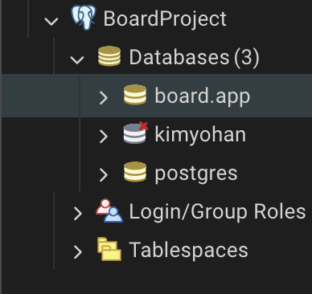
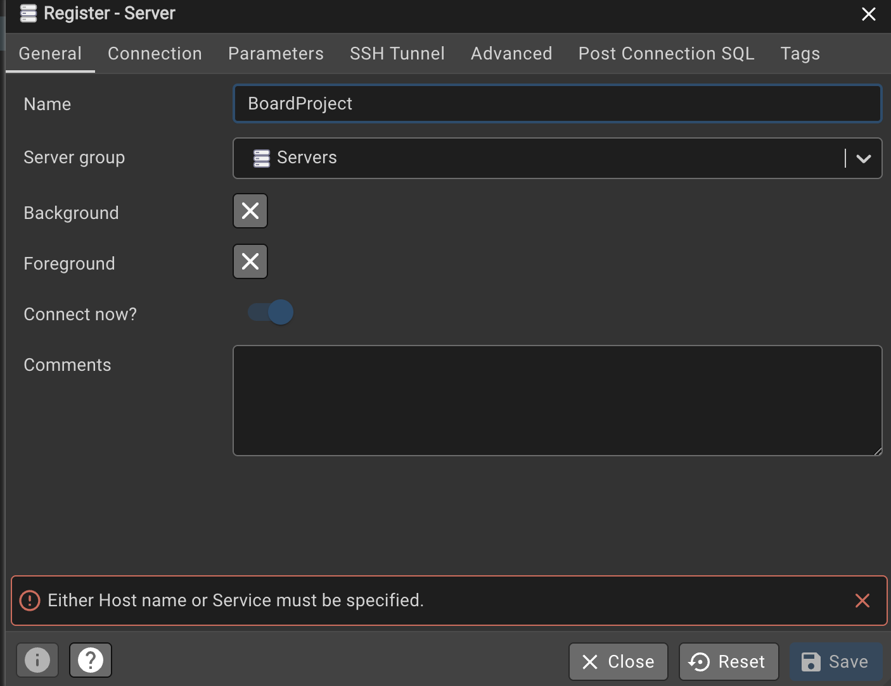

### NestJS_PostgresSQL

- NestJS 기능을 익혀 집중을 하기 위해 데이터를 보관하는데 메모리를 사용한다.
- 애플리케이션에 데이터베이스를 연결해서 데이터베이스에 보관한다.
- Postgres를 사용한다.

---

## 🤔 설치할 프로그램

**1. PostgresSQL**
**2. pgAdmin (데이터베이스를 보는 툴이다)**

**Window에서 PostgresSQL 설치**
https://www.postgresql.org/download/windows/

**Mac에서 PostgresSQL 설치**
https://postgresapp.com/downloads.html

**Window & Mac 에서 pgAdmin 설치**
https://www.pgadmin.org/download/

---

## 서버 세팅

### 1. PostgreSQL 서버 시작

**Mac 사용자 (Postgres.app 설치 시):**

1. Postgres.app 실행
2. 서버 상태가 "Running"인지 확인
3. 기본 포트 5432에서 실행 중인지 확인

**Windows 사용자:**

1. 서비스에서 PostgreSQL 서비스가 실행 중인지 확인
2. 또는 pgAdmin에서 서버 상태 확인

### 2. 서버 연결 정보 (pgAdmin)

pgAdmin 또는 다른 데이터베이스 클라이언트에서 아래 정보로 서버에 연결합니다.

| 항목                     | 값          | 설명                             |
| :----------------------- | :---------- | :------------------------------- |
| **Host name/address**    | `localhost` | 내 컴퓨터에 설치된 DB 서버       |
| **Port**                 | `5432`      | PostgreSQL 기본 포트             |
| **Maintenance database** | `postgres`  | 관리용 기본 데이터베이스         |
| **Username**             | `postgres`  | 최고 관리자 계정                 |
| **Password**             | `postgres`  | 설치 시 설정한 비밀번호 (기본값) |

> 💡 **참고**: 비밀번호는 설치 시 설정한 값입니다. 기본값은 보통 `postgres`입니다.

### 3. 연결 테스트

pgAdmin에서 연결이 성공하면 다음과 같은 구조를 볼 수 있습니다:

- **Servers** → **PostgreSQL** → **Databases** → **postgres**
- 기본 `postgres` 데이터베이스가 생성되어 있음

---

## 데이터베이스 세팅

### 1. 새로운 데이터베이스 생성

pgAdmin에서 새로운 데이터베이스를 생성합니다:

1. **pgAdmin 실행** → **Servers** → **PostgreSQL** 우클릭
2. **Create** → **Database** 선택
3. **General 탭**:
   - **Database**: `board-app` (또는 원하는 데이터베이스 이름)
   - **Owner**: `postgres`
4. **Save** 클릭

### 2. 데이터베이스 연결 확인

새로 생성한 데이터베이스에 연결이 가능한지 확인:

- **Databases** → **board-app** → **Schemas** → **public** 확인
- 연결이 정상적으로 되면 성공!

### 3. 테이블 생성 준비

NestJS 애플리케이션에서 사용할 테이블들을 준비합니다:

- 나중에 TypeORM을 통해 자동으로 생성될 예정
- 또는 수동으로 SQL 스크립트 실행 가능

---

## 2. 초기 데이터 및 파일

프로젝트 초기 설정에 필요한 주요 파일 목록입니다.

- **`board.app`**
  - 프로젝트의 핵심 애플리케이션 또는 데이터베이스 백업 파일입니다. 이 파일을 사용하여 데이터베이스를 초기 상태로 복원하거나 애플리케이션을 실행합니다.

- **`Foreground.png`**
  - 애플리케이션의 메인 화면이나 로고 등으로 사용되는 이미지 파일입니다.

- **`Foreground_second.png`**
  - 애플리케이션의 보조 화면이나 다른 상태를 표시하는 데 사용되는 추가 이미지 파일입니다.
