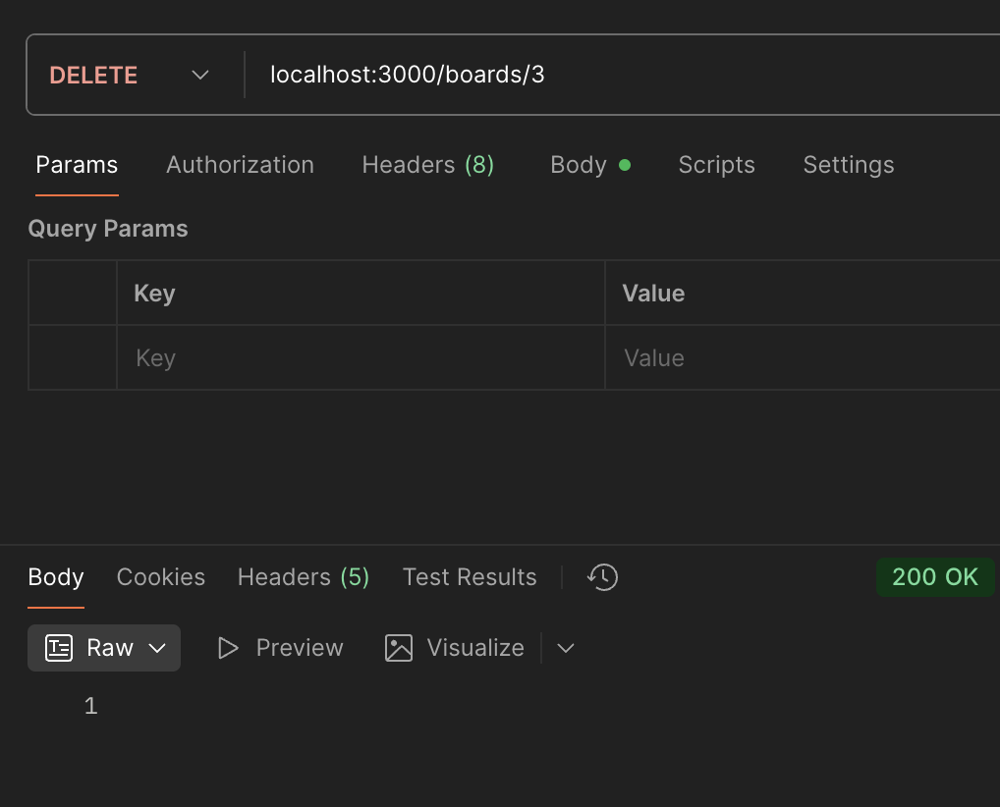

# 게시물 삭제하기

---

## 🔄 remove() vs delete()?

### 1. remove()

- 엔티티를 먼저 조회(로드)한 뒤 삭제를 수행한다. 보통 DB 접근이 최소 2회(find → remove).
- 엔티티 리스너(`@BeforeRemove`, `@AfterRemove`)·서브스크라이버·캐스케이드가 동작한다.
- 존재하지 않는 대상을 제거하려 하면 조회 단계에서 404 흐름으로 이어지는 것이 일반적이다.

- 쉽게 말해: "대상을 먼저 확인하고, 그다음 지운다"는 방식이다.
- 그래서 느리지만, 삭제 전후 훅(리스너)이나 연쇄 삭제(캐스케이드) 같은 **부가 로직이 꼭 필요**할 때 적합하다.
- 존재하지 않으면 조회 단계에서 바로 못 찾았다고 알려줄 수 있다.

### 2. delete()

- 아이템이 존재하면 지우고 존재하지 않으면 아무런 영향이 없다.
- 이러한 차이로 remove를 이용하면 하나의 아이템을 지울 때 두번 데이터베이스를 이용해야 한다.
- 데이터베이스에 한번만 접근해도 되는 delete 메소드를 사용한다.

- 쉽게 말해: "확인하지 말고 바로 지워 봐"라는 한 번에 끝내는 방식이다.
- 훅/캐스케이드가 필요 없고 **속도와 단순함이 중요**할 때 적합하다.
- 대상이 없으면 에러는 아니고, 결과의 `affected`가 0으로 온다. 그래서 서비스에서 `affected === 0`일 때 **404를 직접 던져**주는 식으로 처리한다.

### 3. 삭제 로직

board.service.ts

```ts
  async deleteBoard(id: number): Promise<void> {
    const result = await this.boardRepository.delete(id);

    console.log('result', result);
  }
```

board.controller.ts

```ts
  @Delete('/:id')
  deleteBoard(@Param('id', ParseIntPipe) id: number): Promise<void> {
    return this.boardService.deleteBoard(id);
  }
```

-> 예외사항 추가
board.service.ts

```ts
  async deleteBoard(id: number): Promise<void> {
    const result = await this.boardRepository.delete(id);

    if (result.affected === 0) {
      throw new NotFoundException(`Can't find Board with id ${id}`);
    }
  }
```

---

### 4. 게시물 삭제

[Nest] 12303 - 10/16/2025, 1:58:51 AM LOG [NestApplication] Nest application successfully started +1ms
result DeleteResult { raw: [], affected: 1 }


-> 예외 사항 추가하여 확인할때
{
"message": "Can't find Board with id 5",
"error": "Not Found",
"statusCode": 404
}

---

### 5. ParseIntPipe 설명과 사용하는 이유

- ParseIntPipe는 경로 파라미터처럼 문자열로 들어오는 값을 number로 변환하고, 숫자로 변환할 수 없으면 400(Bad Request)을 발생시킨다.
- 컨트롤러에 진입하기 전에 타입이 보장되므로 서비스 로직이 단순해지고, 잘못된 입력을 초기에 차단한다.

```ts
// boards.controller.ts
@Delete('/:id')
deleteBoard(@Param('id', ParseIntPipe) id: number): Promise<void> {
  return this.boardService.deleteBoard(id);
}
```

---

### 6. 예외(404 Not Found)를 넣는 이유

- 리소스 존재 여부를 명확히 알리기 위함: 없는 게시물을 삭제하려는 요청을 성공처럼 보이게 하면 클라이언트가 상태를 오해한다.
- 클라이언트(프런트/소비자)가 적절히 대응(목록 갱신, 사용자 메시지 표시 등)할 수 있도록 신뢰 가능한 신호를 준다.
- 운영 및 디버깅: 실제 삭제 성공과 대상 미존재를 구분해 로그·모니터링이 용이하다.
- REST 관례: 존재하지 않는 리소스 조작은 404로 응답하는 것이 일반적이다.
